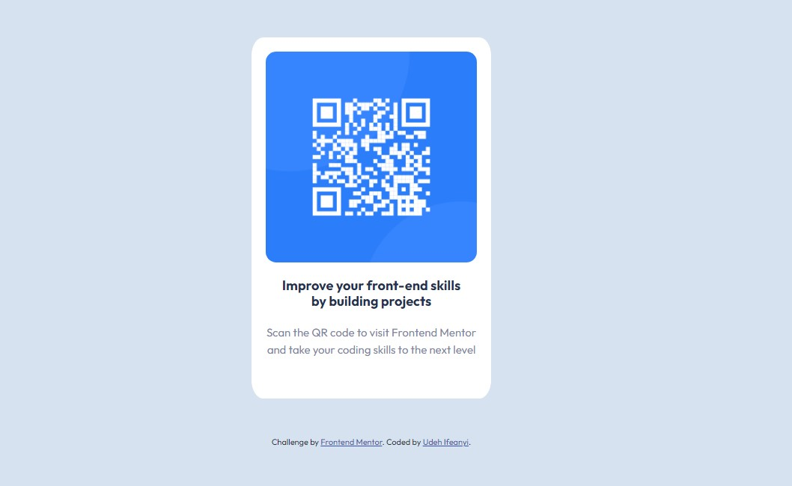

# Frontend Mentor - QR code component solution

This is a solution to the [QR code component challenge on Frontend Mentor](https://www.frontendmentor.io/challenges/qr-code-component-iux_sIO_H). Frontend Mentor challenges help you improve your coding skills by building realistic projects. 

## Table of contents

- [Overview](#overview)
  - [Screenshot](#screenshot)
  - [Links](#links)
- [My process](#my-process)
  - [Built with](#built-with)
  - [What I learned](#what-i-learned)
  - [Continued development](#continued-development)
  - [Useful resources](#useful-resources)
- [Author](#author)

## Overview
This os to the how i carried the solution to this challenge.

### Screenshot

### Links

- Solution URL:  ( https://ifescohub.github.io/scancode/)
- Live Site URL: ( https://ifescohub.github.io/scancode/)

## My process
i started by inserting the image and ten formating the text in my HTML. i added the needed tags and included some classes. i then went further to create a seperate CSS sheet which i linked to my HTML. 

### Built with

- Semantic HTML5 markup
- CSS custom properties
- [Google font](https://fonts.googleapis.com/css2?family=Outfit:wght@400;700&display=swap/) - For styles

### What I learned

By working on this solution, i was able to learn how to resize image using percentages. i was also able to embed a link to google font.

### Continued development

i want to furter improve on how to make my website mobile-responsive.

### Useful resources

 - [Resource 1](https://fonts.googleapis.com/css2?family=Outfit:wght@400;700&display=swap/) - this helped to implement the Outfit font and weights.

## Author

- Website - [Udeh Ifeanyi](https://www.your-site.com)
- Frontend Mentor - [@ifescohub](https://www.frontendmentor.io/profile/ifescohub)
- Twitter - [@UdehIfeanyi10]https://twitter.com/UdehIfeanyi10)

